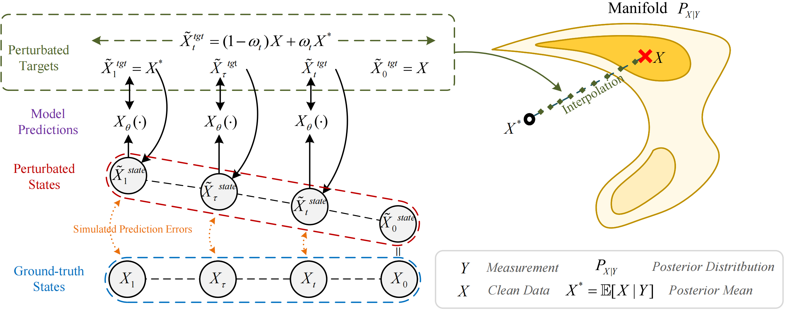

# Regularized Schrödinger Bridge (RSB)
[](LICENSE)

Regularized Schrödinger Bridge (RSB) is an extension of SB-based diffusion models tailored for inverse problems. It introduces a novel regularization strategy that mitigates exposure bias and achieves a more favorable balance between perception and distortion.

- Official PyTorch implementation of the paper:  
[Regularized Schrödinger Bridge: Alleviating Distortion and Exposure Bias in Solving Inverse Problems]()



## Project Structure

- [cli](cli/): Command-line scripts for training, inference, and evaluation
- [config](config/): Configuration files for experiments
- [RSB](RSB/): Core model, SDE, solver, and training code
- [pretrained_predictive_model](pretrained_predictive_model/): Pretrained model chekpoint for various datasets
- [asset](asset/): Figures

## Installation
-  Create a new virtual environment with `Python 3.12` and `Pytorch 2.5.1`.

- Install dependency:
```bash
pip install -r requirements.txt
```

## Get Started

### Configuration

All experiment settings can be adjusted in the YAML files under [config](config/). Before the first run, please be sure to modify and confirm the following in order:
- **Dataset**: Modify the [dataset.yml](config/dataset.yml) file to list the keys and paths for all datasets. Each path should contain `train`, `valid`, and `test` subdirectories, and each of these subdirectories must further contain `clean` and `noisy` folders storing all audio recordings.
- **Run**: Modify the [default.yml](config/default.yml) file (or copy and inherit from it before making changes) to configure the basic information for the run. Training parameters can also be entered via the run script.

### Training

#### Launch with Accelerate
- Configure the accelerate settings:
  ```bash
  accelerate config
  ```

- Train predictive model :
  ```bash
  accelerate launch -m cli.train_predictive\
    --dataset voicebank+demand \
    --predictive_backbone ncsnpp_base \
  ```
  **Arguments for the `train_predictive.py`:**
    - `--dataset`: Specifies the dataset name (e.g., `voicebank+demand`) to be used for training and validation.  
    - `--learning_rate`: Sets the initial learning rate for the Adam optimizer used during training.  
    - `--batch_size`: Defines the number of samples processed per GPU in each training batch.  
    - `--predictive_backbone`: Specifies the backbone architecture (e.g., `ncsnpp_base`) for the predictive model.  
    - `--checkpoint_path`: Provides the path to a saved checkpoint directory for resuming training.  
    - `--patience`: Determines the number of epochs with no validation loss improvement before early stopping is triggered.  
    - `--log_steps`: Sets the frequency (in optimization steps) at which training loss is logged.  
    - `--resume`: When used, indicates that training should resume from the state specified in `--checkpoint_path`.

  Pretrained models for different datasets are available in [pretrained_predictive_model](pretrained_predictive_model/), organized in separate folders by dataset.

- train RSB
  ```bash
  accelerate launch -m cli.train \
    --dataset voicebank+demand \
    --training_method regularization \
    --training_target data \
  ```
  **Arguments for the `train_rsb.py`:**

  *   `--seed`: Sets the random seed for reproducibility across runs.
  *   `--run_name`: (Optional) Specifies a custom name for the training run. If not provided, a name is generated automatically.
  *   `--bridge_type`: Chooses the type of Schrödinger Bridge: `VP` (Variance Preserving) or `VE` (Variance Exploding).
  *   `--dataset`: Specifies the dataset name (e.g., `voicebank+demand`) to be used for training and validation. The dataset must be defined in `config/dataset.yml`.
  *   `--learning_rate`: Sets the initial learning rate for the optimizer (Adam/AdamW).
  *   `--batch_size`: Defines the number of samples processed per GPU in each training batch.
  *   `--num_epoch`: Sets the maximum number of training epochs.
  *   `--run_dir`: Defines the base directory where run outputs (logs, checkpoints) will be saved.
  *   `--log_steps`: Sets the frequency (in training steps) at which training metrics are logged.
  *   `--log_with`: Selects the tool for experiment tracking (e.g., `wandb` for Weights & Biases, or `none`).
  *   `--resume`: Flag to indicate that training should resume from the latest checkpoint found in the specified `--checkpoint_path`.
  *   `--checkpoint_path`: Path to the checkpoint directory from which to resume training (required if `--resume` is used).
  *   `--dummy`: (Placeholder/Unused) Flag for potential dummy runs or testing.
  *   `--training_method`: Specifies the RSB training strategy:
      *   `none`: Standard training.
      *   `optimal`: Conditions the model on an optimal path prediction.
      *   `condition`: Adds the prediction as an additional input condition.
      *   `optimal&condition`: Combines `optimal` and `condition`.
      *   `regularization`(default) : Applies our proposed Distortion-Perception regularization during training.
  *   `--training_target`: Defines the primary target for the training loss:
      *   `data`(default) : Predicts the clean data directly.
      *   `noise`: Predicts the noise component.
      *   `score`: Predicts the score function.
      *   `vector`: Predicts a specific vector field (e.g., `x1 - x0`).
  *   `--regularization_weight`: If `--training_method=regularization`, specifies the weight (`quadratic` or `linear`).

### Inference

- sampling
Use the pre-trained model to enhance noisy audio files. Supports both single files and batch processing of entire directories.

    ```bash
    python -m cli.inference\
      --audio_path /path/to/your/noisy_audio_folder\
      --output_dir /path/to/save/enhanced_audio\
      --model_dir /path/to/run/dir\
      --num_step 50
    ```
  **Arguments for the `inference.py`:**
  - `--audio_path`: Path to noisy audio files (can be a single file or a folder)
  - `--output_dir`: Directory to save enhanced audio files
  - `--model_dir`: Directory containing model weights and configuration files
  - `--num_step`: Number of sampling steps (higher values generally improve quality but increase processing time) 

- Calculate metrics:
Calculate common speech enhancement evaluation metrics such as SI-SNR, PESQ, and STOI to measure enhancement performance.

  ```bash
  python -m cli.calc_metric\
    --clean_dir /path/to/your/clean_audio_folder \
    --noisy_dir /path/to/your/noisy_audio_folder  \
    --enhanced_dir /path/to/your/enhanced_audio_folder
  ```
  **Arguments for the `calc_metric.py`:**
  - `--clean_dir`: Directory containing clean speech (ground truth)
  - `--noisy_dir`: Directory containing noisy speech (for baseline comparison)
  - `--enhanced_dir`: Directory containing enhanced speech processed by the model

## License

This project is licensed under the [Apache License 2.0](LICENSE).