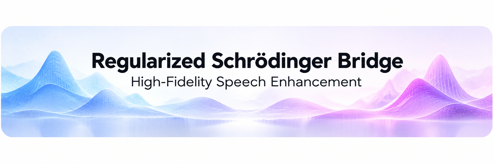
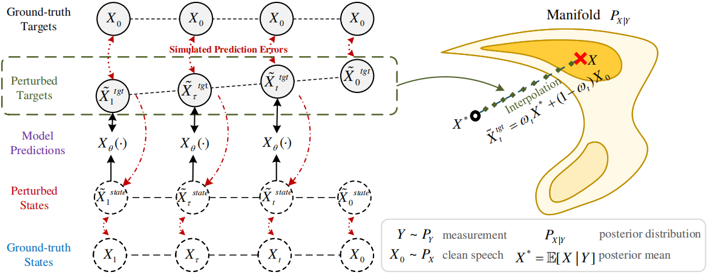
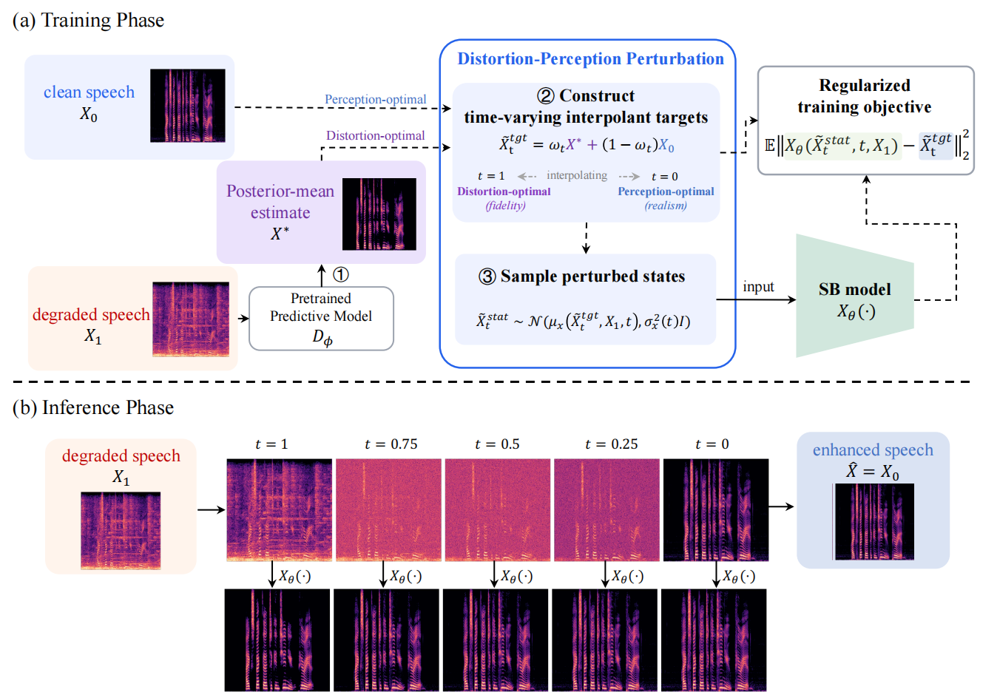

<div align="center">

  
**Regularized Schrödinger Bridge** is a generative speech enhancement framework that regularizes Schrödinger Bridge training to
reduce exposure bias and improve the fidelity–realism tradeoff.

[](LICENSE)
[](https://yorch233.github.io/RSB/)
[](https://github.com/Yorch233/RSB)
[](https://huggingface.co/Yorch233/RSB)

</div>

______________________________________________________________________

- Official PyTorch implementation of *[Regularized Schrodinger Bridge via Distortion-Perception Perturbation for High-Fidelity Speech Enhancement](https://ieeexplore.ieee.org/document/11623672)*.

&nbsp;


*Distortion-perception perturbation interpolates clean targets with offline posterior-mean estimates, producing
time-varying targets between distortion-optimal fidelity and perceptual realism.*

&nbsp;



*RSB first trains a predictive model, exports posterior means, and then trains a regularized bridge that enhances
degraded speech through iterative reverse-time sampling.*

## For Human

Copy and paste this prompt to your coding agent (Claude Code, Codex, OpenCode, etc.):

```bash
Install and configure RSB by following the instructions here: https://raw.githubusercontent.com/Yorch233/RSB/refs/heads/main/docs/installation.md
```

## For Agent

Fetch the installation guide and follow it:

```bash
curl -s https://raw.githubusercontent.com/Yorch233/RSB/refs/heads/main/docs/installation.md
```

## Skip This README

We're past the era of reading docs. Just paste this into your agent:

Read this and tell me why it's not just another boilerplate: [README](https://raw.githubusercontent.com/Yorch233/RSB/refs/heads/main/README.md)

## Documentation

- [Installation and runtime configuration](docs/installation.md)
- [Dataset preparation, registration, and posterior means](docs/datasets.md)
- [Predictive, SB, and RSB training](docs/training.md)
- [Predictive and generative inference](docs/inference.md)
- [Metrics and third-party evaluation](docs/metrics.md)

## Manual Start

Run every command from the repository root. The examples assume the registered dataset ID `voicebank`. Replace all
paths and generated run names with values for your deployment.

### Virtual environment

#### Step 1 — Create the virtual environment

```bash
uv sync
```

`uv sync` creates the project virtual environment from `pyproject.toml`. See the
[installation guide](docs/installation.md) for host prerequisites and UV installation.

### Data preparation

#### Step 2 — Create or register paired data

RSB expects aligned WAV files under `{train,valid,test}/{clean,noisy}`. You can either download Voicebank+DEMAND and
arrange it into this layout, or build a paired dataset from separate clean-speech and noise corpora. Supported clean
sources are WSJ0, VCTK, and TIMIT; supported additive-noise sources are WHAM!, CHiME, and QUT. This work uses WSJ0 as
the clean corpus and WHAM! as the noise corpus.

Create a WSJ0+WHAM! denoising dataset with the `enhancement` task:

```bash
uv run rsb dataset create \
  --task enhancement \
  --clean wsj0 /path/to/wsj0 \
  --noise wham /path/to/wham \
  --output-dir /path/to/wsj0-wham
```

Create a reverberation-only dataset with the `dereverberation` task:

```bash
uv run rsb dataset create \
  --task dereverberation \
  --clean wsj0 /path/to/wsj0 \
  --noise none /path/to/wsj0 \
  --output-dir /path/to/wsj0-reverb
```

For the reverberation-only command, the path supplied with `--noise none` must exist but its audio is not mixed. See
the [dataset guide](docs/datasets.md) for the required source layouts, synthesis parameters, and combined-task export.

Register Voicebank+DEMAND or an output directory created above for training:

```bash
uv run rsb dataset add --id voicebank --path /path/to/Voicebank+Demand --select
```

Replace the path with `/path/to/wsj0-wham` or `/path/to/wsj0-reverb` when registering a dataset
created by this project.

### Configuration

#### Step 3 — Configure the training environment

```bash
uv run rsb config
```

The configuration wizard stores host-specific GPU, precision, logging, checkpoint, dataset, run, and result settings
in the ignored `.config/rsb.yml`. See the [installation guide](docs/installation.md) for configuration choices.

### Training

#### Step 4 — Train the predictive model

```bash
uv run rsb train predictive --dataset voicebank
```

The command creates a `rsb_predictive_MMDDhhmm` run containing resumable Lightning state, `config.yml`, and the best
validation `model.safetensors`.

#### Step 5 — Generate offline posterior means

```bash
uv run rsb dataset generate-mean \
  --run rsb_predictive_MMDDhhmm \
  --dataset voicebank
```

This writes posterior means for train, valid, and test below `<dataset>/<split>/mean/NCSN++M/`.

#### Step 6 — Reproduce SB or RSB

Train vanilla Schrödinger Bridge:

```bash
uv run rsb train generative \
  --dataset voicebank \
  --training-method none
```

Train Regularized Schrödinger Bridge:

```bash
uv run rsb train generative \
  --dataset voicebank \
  --training-method regularization \
  --posterior-mean-from NCSN++M
```

Reproduction-critical controls:

- `--training-method`: `none` reproduces vanilla SB; `regularization` reproduces RSB and is the default.
- `--posterior-mean-from`: selects the dataset's `mean/<source>` directory. It defaults to `NCSN++M` for RSB and is
  not applicable to vanilla SB.
- `--schedule`: selects `VE` or `VP`; the released configuration defaults to `VE`.

All optimizer, runtime, objective, resume, and distributed options are documented in the [training guide](docs/training.md).

### Inference and evaluation

#### Step 7 — Enhance the test set and calculate metrics

```bash
uv run rsb inference generative \
  --run rsb_generative_MMDDhhmm \
  --dataset voicebank \
  --sampler SDE \
  --num-steps 50

uv run rsb metric \
  --dir results/rsb_generative_MMDDhhmm/SDE_N=50 \
  --metrics pesq,estoi,si_sdr
```

For released RSB reproduction, keep `--sampler SDE` and explicitly record `--num-steps`. Omitting `--run` downloads
the default [`Yorch233/RSB`](https://huggingface.co/Yorch233/RSB) checkpoint. See the [inference guide](docs/inference.md)
and [metrics guide](docs/metrics.md) for complete options, result layouts, and troubleshooting.

## Citation

If you use RSB in your research, please cite the accompanying paper. 
```
@article{yao2026rsb, 
  author  = {Yao, Qing and Gao, Lijian and Mao, Qirong and Dong, Ming},
  title   = {Regularized Schr{\"o}dinger Bridge via Distortion-Perception Perturbation for High-Fidelity Speech Enhancement},
  journal = {IEEE Transactions on Audio, Speech and Language Processing},
  year    = {2026},
  month   = jul,
  doi     = {10.1109/TASLPRO.2026.3717234},
  note    = {Early Access}
}
```

## Acknowledgements

We thank the [StoRM](https://github.com/sp-uhh/storm) for providing its scripts for data processing and complex spectrogram feature extraction, which served as references for our implementation.

## License

RSB is licensed under the [Apache License 2.0](LICENSE).
